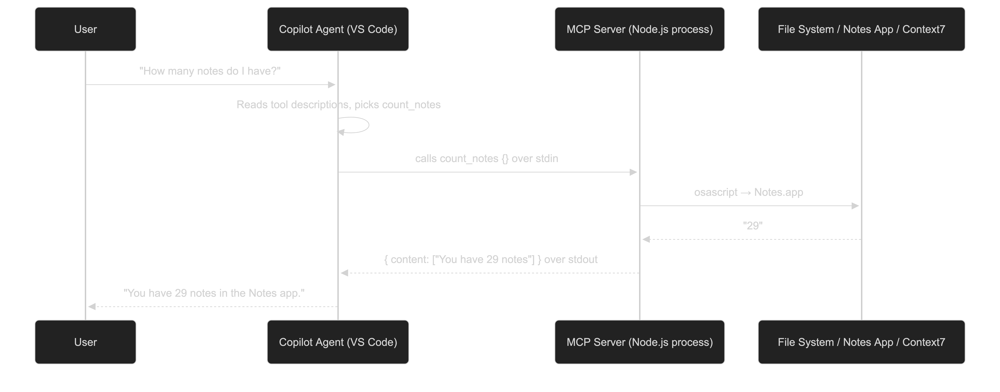

# My MCP Server

A local **Model Context Protocol (MCP)** server that uses STDIN/STDOUT to talk with AI agents to access our file system and macOS Notes app.
> The first 3 tools i created won't be used because vs-code uses its built in tools such as 'list_dir' instead of using my 'list_directory'
---

## Tools

| Tool | What it does |
|---|---|
| `read_file` | Reads the full content of any local file |
| `list_directory` | Lists files and folders inside a directory |
| `get_library_docs` | Fetches up-to-date docs from Context7 for any library |
| `count_notes` | Returns how many notes you have in the macOS Notes app |

---

## How it works

<div align='center'>
	
</div>


---

## Setup

```bash
cd McpServer
npm install
npm run build
```

VS Code auto-starts the server via `.vscode/mcp.json` whenever Copilot Agent connects.

---

## Stack

- **Runtime:** Node.js 18+
- **Language:** TypeScript
- **MCP SDK:** `@modelcontextprotocol/sdk`
- **Schema validation:** Zod
- **Transport:** stdio (stdin/stdout pipes)
